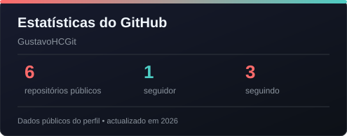
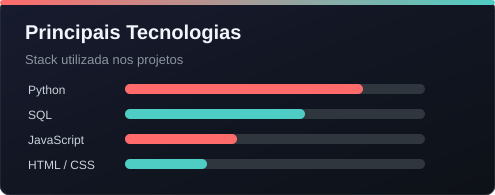

# 📊 Gustavo Henrique Constante Neto

### 🎯 Estudante de Análise de Dados | Buscando Estágio

*Transformando dados brutos em insights que geram valor*

---

## 👤 Sobre Mim

Sou estudante apaixonado por **Análise de Dados**, em busca da minha primeira oportunidade de estágio para aplicar e expandir meus conhecimentos em um ambiente profissional. Gosto de transformar dados complexos em histórias claras, que ajudam a entender problemas e tomar decisões melhores.

Tenho experiência prática com **Python, SQL, Pandas, Streamlit, Plotly e FastAPI**. Também estou sempre estudando novas ferramentas e maneiras de melhorar meus projetos, desde a organização dos dados até a apresentação dos resultados.

## 🛠️ Stack Tecnológica

<table align="center">
  <tr>
    <td align="center">
      <b>Linguagem</b> 
      
      
    </td>
  </tr>
  <tr>
    <td align="center">
      <b>Análise & Manipulação</b> 
      
      
    </td>
  </tr>
  <tr>
    <td align="center">
      <b>Visualização</b> 
      
      
      
    </td>
  </tr>
  <tr>
    <td align="center">
      <b>Apps & Dashboards</b> 
      
      
    </td>
  </tr>
  <tr>
    <td align="center">
      <b>Database & Ferramentas</b> 
      
      
      
    </td>
  </tr>
</table>

---

## 🚀 Projetos em Destaque

| Projeto | Descrição | Stack |
|---------|-----------|-------|
| 📊 **[Banco Analytics](https://github.com/GustavoHCGit/banco-analytics)** | Pipeline completo com dados sintéticos, tratamento de qualidade, carga no PostgreSQL e dashboard de transações bancárias. | Python, Pandas, PostgreSQL, Streamlit, Plotly |
| 📊 **[Dashboard de Gestão de Inventário](https://github.com/GustavoHCGit/sistema-gestao-inventario-inteligente)** | Dashboard interativo com gráficos Plotly, gestão de produtos e vendas em tempo real. | Streamlit, SQLite, Plotly |
| 🕷️ **[Web Scraper de Vagas](https://github.com/GustavoHCGit/web-scraper-vagas)** | Coleta vagas de emprego em tempo real com tratamento robusto de erros. | Python, BeautifulSoup, Pandas |
| 🔧 **[API de Gerenciamento de Tarefas](https://github.com/GustavoHCGit/api-gerenciamento-tarefas)** | API RESTful para CRUD de tarefas com autenticação e validação. | FastAPI, Pydantic, SQLite |
| 💰 **[Controle Financeiro CLI](https://github.com/GustavoHCGit/controle-financeiro-cli)** | Aplicativo CLI para controle financeiro pessoal com relatórios. | Python, SQLite |

---

## 📊 Estatísticas do GitHub

---

## 📬 Contato

---

*Aberto a novas conexões e oportunidades de estágio em Análise de Dados!* 🚀

